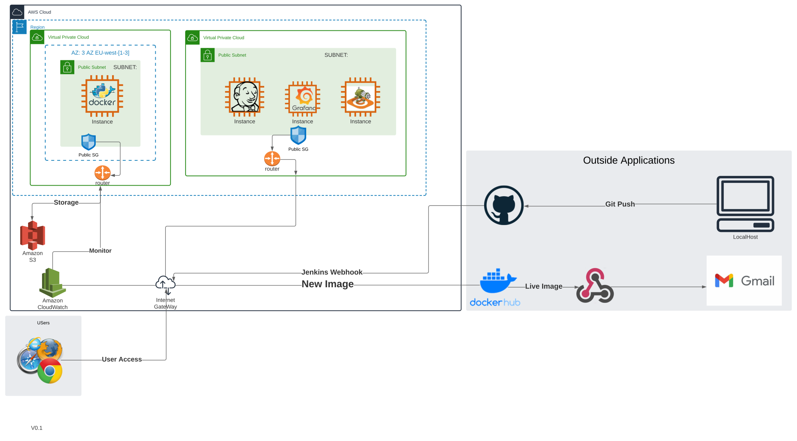

# Testing 

## Project Diagram 

Project Overview

## Aim of the Project
### The aim of this project is to successfully deploy a web app on a browser by building a CI/CD pipeline on Jenkins.
Task:
- Fix bugs on the python app and test using TTD on Pytest 
- Push to Dev branch on github 
- Build a Jenkins server on an EC2 instance on AWS
- Create a webhook and first job in the pipeline is to test the git commit and merge to main branch (pytest has to pass)
- Create an AWS environment to run the app
- Containerise the app and upload image to dockerhub 
- Create an EC2 instance to run the containerised app
- Check app is available on browser
- Generate HAR file to generate Scala script to run gatling tests
- Create a Gatling Instance 
- Monitor using CloudWatch and Grafana 
- Create an S3 bucket with the CSV file for disaster recovery
- Create a webhook trigger to send emails once a docker image is uploaded to the repo

# Gatling 

- Script based performance testing tool
- Uses Scala to write the tests
- Used for Heavy Load Testing
- Can easily be hooked into CI/CD Jenkins pipeline
- Less RAM and CPU utilisation

## Steps to Install Gatling 

1. Download Gatling open source on c drive - https://gatling.io/
2. Install Scala as a plugin on IntelliJ
3. Install Java JDK (8 or above) - https://www.oracle.com/java/technologies/downloads/#jdk17-windows
4. Copy Java bin path into PATH system variable
5. Copy Java path into JAVA_HOME variable
6. Check version – Java -version
7. Run gatling.bat

## Generating HAR file

1. On your website > f12 > Developer tools > Network
2. Record your interaction with the website
3. Export HAR file
4. Open recorder.bat from terminal
5. Recorder mode > HAR Converter
6. Look for HAR file previously exported
7. Run gatling.bat and select option for the file exported
8. Gatling test IP given